## HR Data Analysis Project

### About Data

### Objectives Of Analysis

**The main purpose of this analysis is to answer the following questions to gain a deeper understanding of the data.**

1. To understand the most paid career?
2. What is the average salary of each category?
3. How does gender affect the salary of an employee?
4. How does race(white/black/Asian...) affect the salary of an employee?
5. How does race(white/black/Asian...) affect employee position?
6. How does absence affect the salary of an individual?
7. What is the most common recruitement source and how does recruitement source affect salary and `EmpSatisfaction`?
8. What is the categorization count for `EmploymentStatus`?
9. What is the average salary based on department?
10. Which state has the most paid salary?
11. What is the most common reason for termination?
12. What is the most common reason for termination by race?
13. What is the most common `EmploymentStatus`?
14. Which recruitment source give employees with best performance score?
15. Which department has the most absenties?
16. Which race has the most absenties?
17. Which department has the best employee satisfactions?
18. Which race has the most satisfied employees?
19. What is the employee satisfaction levels for married/single people?
20. Which state has the most satisfied employees?
21. Which state are you likely to get a job(Position) by category?
22. What is the average age of employees in each department?
23. Average age by each race?
24. What is the average age of each position?

### Procedures Followed

1.  #### Data Cleaning

    1. Delete unwanted columns, the following columns will be deleted as they will not be important in the analysis project.

    1. `EmpID`
    1. `MarriedID`
    1. `MaritalStatusID`
    1. `GenderID`
    1. `EmpStatusID`
    1. `DeptID`
    1. `PerfScoreID`
    1. `FromDiversityJobFairID`
    1. `Employee_Name`
    1. `ManagerName`
    1. `ManagerID`
    1. `Zip`
    1. `PositionID`
    1. `Zip`

2.  #### Database creation

    1. Drop all the unwanted columns listed above. This should be done in the CSV file.
    2. Create a database with the remaing columns:

| Column Name                | Column Datatype |
| :------------------------- | :-------------: |
| Employee_Name              |  VARCHAR(100)   |
| Salary                     | DECIMAL(10, 2)  |
| Position                   |  VARCHAR(100)   |
| State                      |  VARCHAR(100)   |
| DOB                        |      DATE       |
| Sex                        |   VARCHAR(1)    |
| MaritalDesc                |  VARCHAR(100)   |
| CitizenDesc                |  VARCHAR(100)   |
| HispanicLatino             |   VARCHAR(10)   |
| RaceDesc                   |   VARCHAR(30)   |
| DateofHire                 |      DATE       |
| DateofTermination          |   DATE & NULL   |
| TermReason                 |  VARCHAR(100)   |
| EmploymentStatus           |  VARCHAR(100)   |
| Department                 |  VARCHAR(100)   |
| ManagerName                |  VARCHAR(100)   |
| ManagerID                  |       INT       |
| RecruitmentSource          |  VARCHAR(100)   |
| PerformanceScore           |  VARCHAR(100)   |
| EngagementSurvey           |      FLOAT      |
| EmpSatisfaction            |       INT       |
| SpecialProjectsCount       |       INT       |
| LastPerformanceReview_Date |      DATE       |
| DaysLateLast30             |       INT       |
| Absences                   |       INT       |

## Scripts For Questions Listed

#### 1. To understand the most paid career

```sql
-- To understand the most paid career
SELECT
	Department,
    SUM(Salary) AS sum_salary
FROM HR_data
GROUP BY Department
ORDER BY sum_salary DESC;
```

#### 2. What is the average salary of each category?

```sql
-- What is the average salary of each category?
SELECT
	Department,
    AVG(Salary) AS avg_salary
FROM HR_data
GROUP BY Department
ORDER BY avg_salary DESC;
```

#### 3. How does gender affect the salary of an employee

```sql
-- How does gender affect the salary of an employee
SELECT
	Department,
    Sex,
    AVG(Salary) AS avg_salary
FROM HR_data
GROUP BY Department, Sex
ORDER BY Department, RaceDesc;
```

#### 4. How does race(white/black/Asian...) affect the salary of an employee

```sql
-- How does race(white/black/Asian...) affect the salary of an employee
WITH CTE_tbl1 AS (SELECT
	Department,
    RaceDesc,
    AVG(Salary) AS avg_salary
FROM HR_data
GROUP BY Department, RaceDesc)
SELECT
	*,
    ROW_NUMBER() OVER(PARTITION BY Department ORDER BY Department, avg_salary DESC) AS position
FROM CTE_tbl1;
```

#### 5. How does race(white/black/Asian...) affect employee position?

```sql
-- How does race(white/black/Asian...) affect employee position?
WITH cte_tbl AS (SELECT
	Position,
    RaceDesc,
    COUNT(Position) AS cnt_pos
FROM HR_data
GROUP BY Position, RaceDesc)
SELECT
	*,
    ROW_NUMBER() OVER(PARTITION BY Position ORDER BY cnt_pos DESC) AS rank_position
FROM cte_tbl;
```

#### 7. What is the most common recruitement source and how does recruitement source affect salary and EmpSatisfaction?

```sql
-- What is the most common recruitement source and how does
-- recruitement source affect salary and EmpSatisfaction?
SELECT
	RecruitmentSource,
    AVG(Salary) as avg_salary,
	COUNT(RecruitmentSource) AS count
FROM HR_data
GROUP BY RecruitmentSource
ORDER BY avg_salary DESC;
```

#### 8. What is the categorization count for EmploymentStatus?

```sql
-- What is the categorization count for EmploymentStatus?
SELECT
	*,
    ROW_NUMBER() OVER(PARTITION BY Department ORDER BY Department DESC) AS status_rank
FROM(SELECT
	Department,
    EmploymentStatus,
    COUNT(EmploymentStatus) AS status
FROM HR_data
GROUP BY Department, EmploymentStatus
ORDER BY Department, status DESC) AS subquery;
```

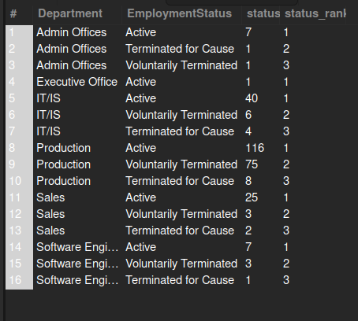

#### 9. What is the average salary based on department?

```sql
-- What is the average salary based on department?
SELECT
	Department,
    AVG(Salary) AS avg_salary
FROM HR_data
GROUP BY Department
ORDER BY avg_salary DESC;
```

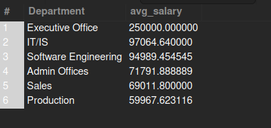

#### 10. Which state has the most paid salary?

```sql
-- Which state has the most paid salary?
SELECT
	State,
    AVG(Salary) AS avg_salary
FROM HR_data
GROUP BY State
ORDER BY avg_salary DESC;
```

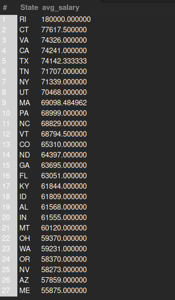

#### 11. What is the most common reason for termination?

```sql
-- What is the most common reason for termination?
SELECT
	TermReason,
    COUNT(TermReason) AS count
FROM HR_data
GROUP BY TermReason
ORDER BY count DESC;
```

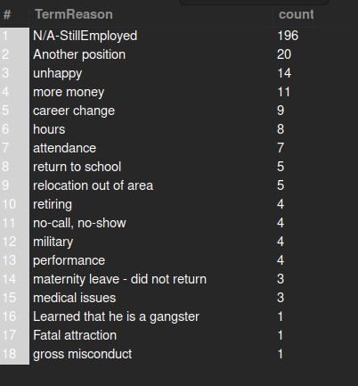

#### 12. What is the most common reason for termination by race?

```sql
-- What is the most common reason for termination by race?
SELECT
	RaceDesc,
	TermReason,
    COUNT(TermReason) AS count
FROM HR_data
GROUP BY TermReason, RaceDesc
ORDER BY RaceDesc, count DESC;
```

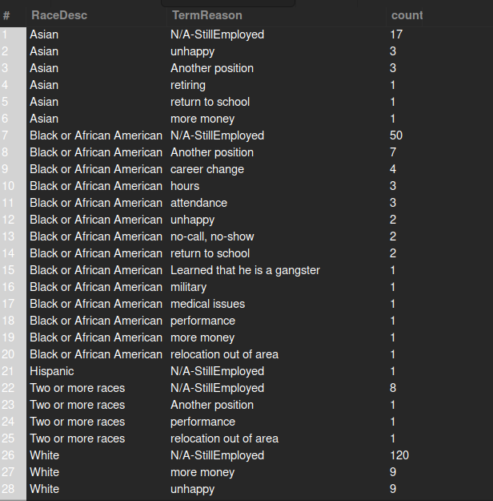

#### 13. What is the most common EmploymentStatus?

```sql
-- What is the most common EmploymentStatus?
SELECT
	EmploymentStatus,
    COUNT(EmploymentStatus) AS count
FROM HR_data
GROUP BY EmploymentStatus
ORDER BY count DESC;
```

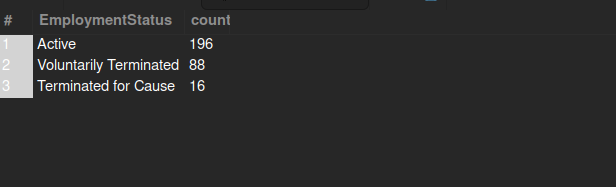

#### 14. Which recruitment source give employees with best performance score?

```sql
-- Which recruitment source give employees with best performance score?
SELECT
	RecruitmentSource,
    PerformanceScore,
    COUNT(PerformanceScore) AS perf_cnt
FROM HR_data
GROUP BY RecruitmentSource, PerformanceScore
ORDER BY RecruitmentSource, PerformanceScore;
```

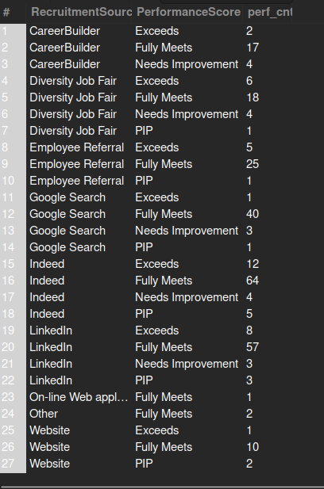

#### 15. Which department has the most absenties?

```sql
-- Which department has the most absenties?
SELECT
	Department,
    SUM(Absences) AS absence_cnt
FROM HR_data
GROUP BY Department
ORDER BY absence_cnt DESC;
```

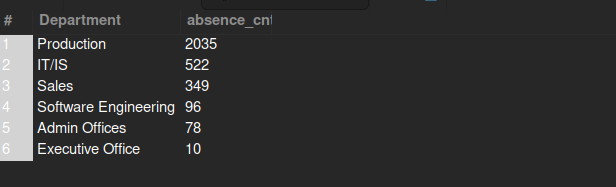


#### 16. Which race has the most absenties?

```sql
-- Which race has the most absenties?
SELECT
	RaceDesc,
    SUM(Absences) AS absence_cnt
FROM HR_data
GROUP BY RaceDesc
ORDER BY absence_cnt DESC;
```

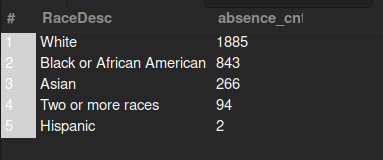

Looks like the `white` race has most absenties, this does not give a clear picture, when you tend to get the mean. May be because they are the most in our dataset.

To prove this further, lets get the count of each race as well.

```sql
SELECT
	RaceDesc,
    SUM(Absences) AS absence_cnt,
    COUNT(RaceDesc) as race_cnt
FROM HR_data
GROUP BY RaceDesc
ORDER BY absence_cnt DESC;
```

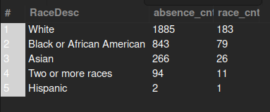

The data is positively skewed, in such a case, the mean is not the best measure for central tendency. The `median` is much preferred in such case.

**Statistical Reading sources**

1. [Measures of central tendencies](https://www.abs.gov.au/statistics/understanding-statistics/statistical-terms-and-concepts/measures-central-tendency#:~:text=In%20a%20skewed%20distribution%2C%20the,the%20middle%20of%20the%20distribution.)

#### 17. Which department has the best employee satisfactions?

```sql
-- Which department has the best employee satisfactions?
SELECT
	Department,
    ROUND(AVG(EmpSatisfaction), 2) AS avg_empl_satisfaction
FROM HR_data
GROUP BY Department
ORDER BY avg_empl_satisfaction DESC;
```

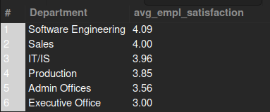

Software engineers tend to be the most satisfied employees. What could be the reason for this? Salary?

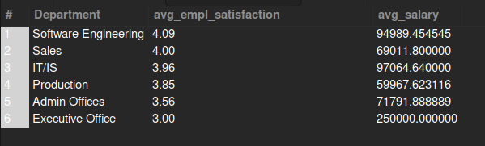

Well, average salary isn't the case. Does the saying, **"money can't buy happiness"** true? There must be some other parameter affecting this. A leave this to open discussion.


#### 18. Which race has the most satisfied employees?

```sql
-- Which race has the most satisfied employees?
SELECT
	RaceDesc,
    ROUND(AVG(EmpSatisfaction), 2) AS avg_empl_satisfaction,
    AVG(Salary) AS avg_salary
FROM HR_data
GROUP BY RaceDesc
ORDER BY avg_empl_satisfaction DESC;
```

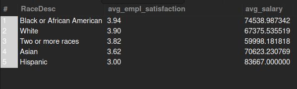

Using `Average` in the cases may not give us a clearer picture as they counts of each category is different. `Median` is probably a better measure for this. Using SQL for `median` calculation is abit of work. Keep this in mind, `average` is not the best measure in such a case and all the cases when I applied the mean.


#### 19. What is the employee satisfaction levels for married/single people?

```sql
-- What is the employee satisfaction levels for married/single people?
SELECT
	MaritalDesc,
    ROUND(AVG(EmpSatisfaction), 2) AS avg_empl_satisfaction,
    AVG(Salary) AS avg_salary
FROM HR_data
GROUP BY MaritalDesc
ORDER BY avg_empl_satisfaction DESC;
```

Again `mean` as a measure of central tendency does not give a clear picture in this case as each `MaritalDesc` section is different in count.

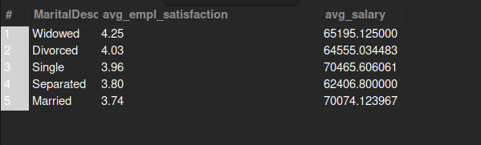


#### 20. Which state has the most satisfied employees?

```sql
-- Which state has the most satisfied employees?
SELECT
	State,
    ROUND(AVG(EmpSatisfaction), 2) AS avg_empl_satisfaction,
    AVG(Salary) AS avg_salary,
    COUNT(State) AS state_cnt
FROM HR_data
GROUP BY State
ORDER BY avg_empl_satisfaction DESC;
```

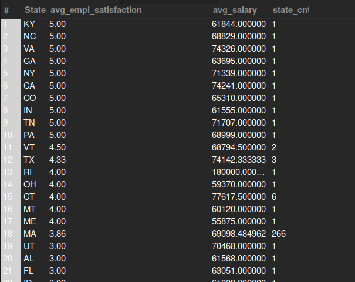

#### 22. What is the average age of employees in each department?


```sql
-- What is the average age of employees in each department?
SELECT
	Department,
    AVG(ROUND(DATEDIFF(NOW(), DOB) / 365, 1)) AS avg_age
FROM HR_data
GROUP BY Department;
```

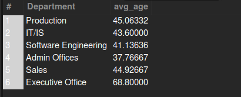


#### 23. Average age by each race?

```sql
SELECT
	RaceDesc,
    AVG(ROUND(DATEDIFF(NOW(), DOB) / 365, 1)) AS avg_age
FROM HR_data
GROUP BY RaceDesc
ORDER BY avg_age DESC;
```

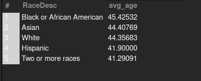


#### 24. What is the average age of each position?

```sql
-- What is the average age of each position?
SELECT
	Position,
    AVG(ROUND(DATEDIFF(NOW(), DOB) / 365, 1)) AS avg_age
FROM HR_data
GROUP BY Position
ORDER BY avg_age DESC;
```

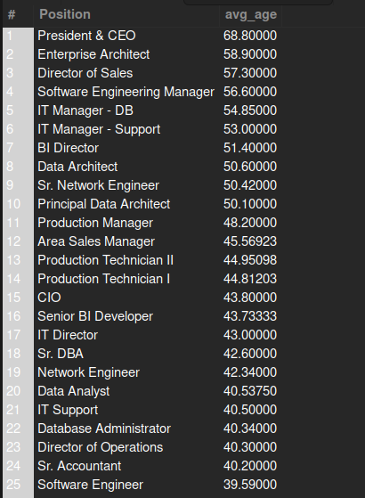